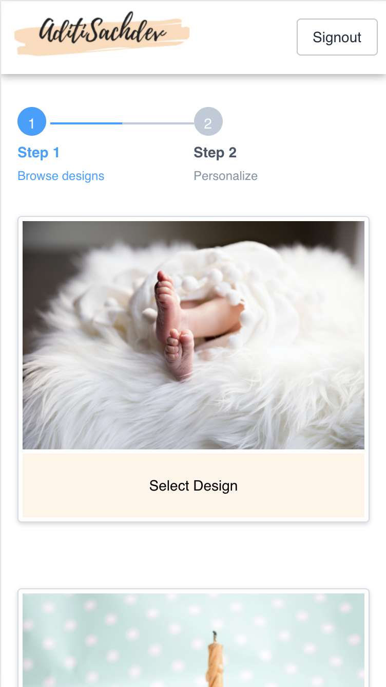
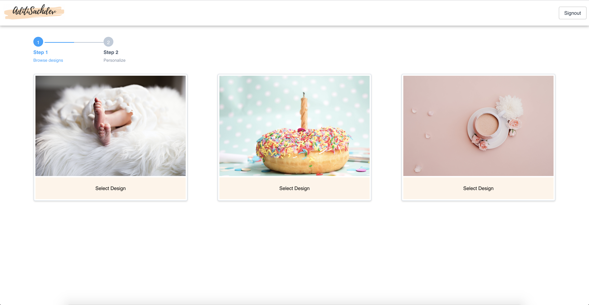
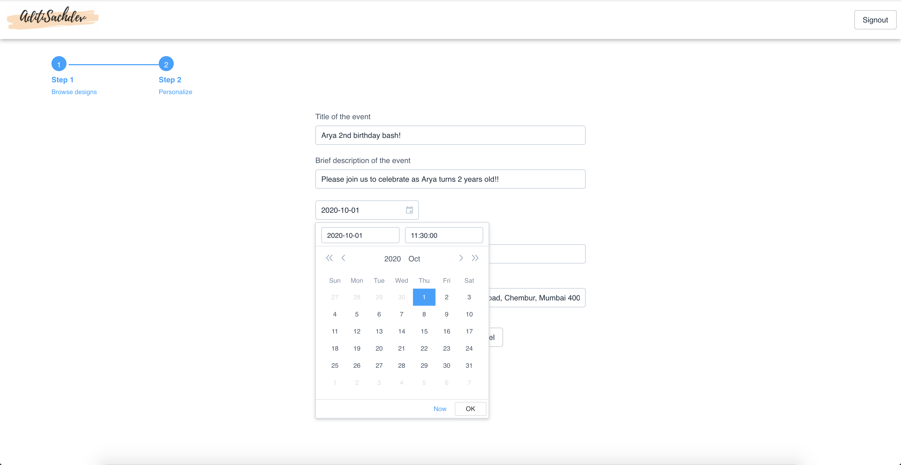
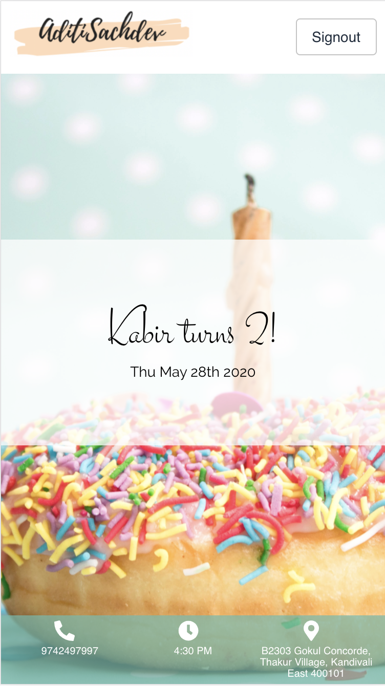

# aamantran
This is a sample project demonstrating a web app built using React & GraphQL frontend and a Django backend. 

## Introduction
The website is a basic event invitation portal. It allows creating invites using inbuilt designs. 

Features: 
* Customisable event templates
* RSVP (in progress)
* Maps Integration (in progress)

## Screenshots:
#### Step 1 of Create Invite flow:
##### On Mobile:

##### On Desktop:

#### Step 2 of Create Invite flow:

#### Invitation Main:
##### On Mobile:

##### On Desktop:

## Project Structure
There are two top level folders:
* client: Contains the React/GraphQL frontend app
* server: Contains the Django/GraphQL backend server

Each folder contains instructions on setting up the respective component

## Attribution
Following is the original source for the images used in the inbuilt event templates: 
* [baby_feet](https://unsplash.com/photos/WCF44_NFUyA)
* [donut_with_sprinkles](https://unsplash.com/photos/ww8hljWABIE)
* [elegant_teacup](https://unsplash.com/photos/qNhe2QXzLuo)
